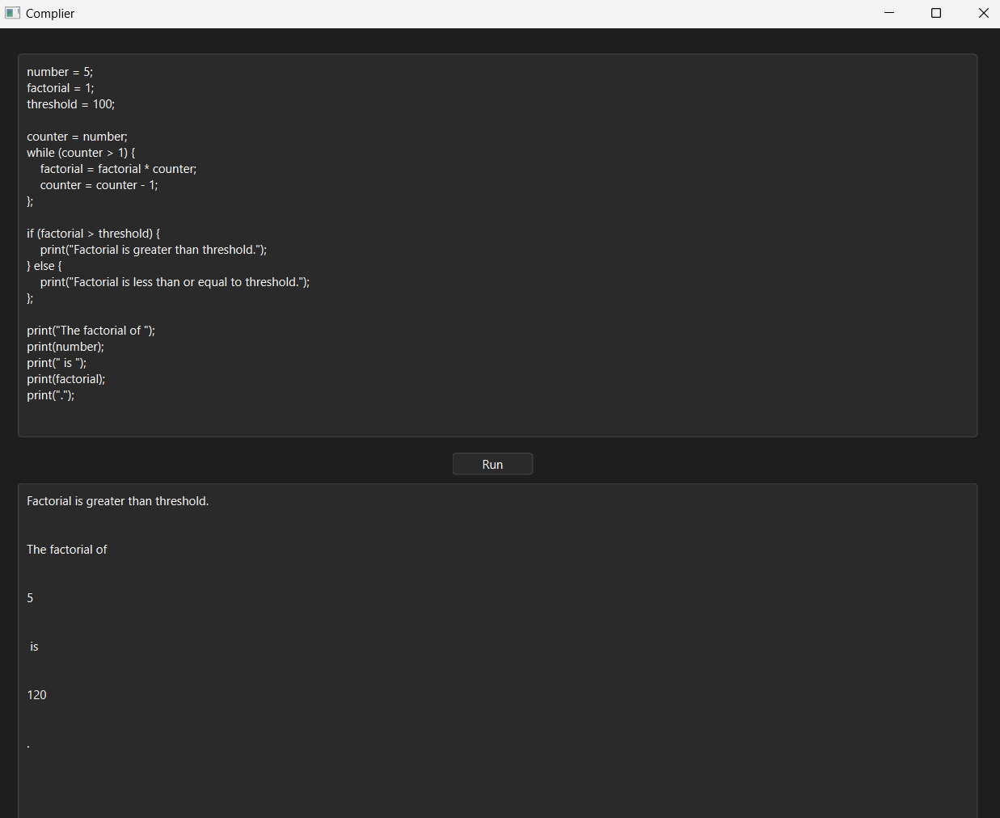

# PLC Programming Language Project

This project, part of the Programming Languages and Compilers course, introduces a custom programming language designed to facilitate understanding of variable management, control flow, arithmetic operations, and basic boolean expressions. It includes an interpreter environment to run and test code.

## Table of Contents
- [Team Information](#team-information)
- [Contact Person](#contact-person)
- [Features](#features)
- [Installation and Setup](#installation-and-setup)
- [Language Syntax Guide](#language-syntax-guide)
- [Running the Project](#running-the-project)
- [Parser Grammar Report](#parser-grammar-report)
- [Lexer Report](#lexer-report)
- [Example Program](#example-program)

## Team Information

| Student ID | Full Name        | Contribution                               |
|------------|------------------|-------------------------------------------|
| st124145   | Minn Banya       | Collaborative design, coding, and testing |
| st124359   | Phone Myint Zaw  | Collaborative design, coding, and testing |
| st124390   | Puthi Soptey     | Collaborative design, coding, and testing |


### Contact Person
- **Name**: Minn Banya
- **Email**: st124145@ait.asia
- **Phone Number**: 0625789069

## Features

1. **Data Types**: Supports integers, floats, and booleans.
2. **Type Checking**: Implements dynamic typing.
3. **Arithmetic Expressions**: Supports the four basic operators (`+`, `-`, `*`, `/`) with conventional precedence rules.
4. **Boolean Expressions**: Supports equality (`==`) and inequality (`!=`) comparisons. Also supports (`<`) and (`>`) relational comparisons.
5. **Control Structures**: Includes if-then-else statements and while loops.
6. **Output Functionality**: Features a `print()` function for output.

## Installation and Setup

### Prerequisites
Ensure that Python 3.7 or higher is installed on your machine.

### Steps to Setup

1. Clone the repository to your local machine:
   ```bash
   git clone https://github.com/minnbanya/PLC-Programming-Language-Project  
2. Change into the project directory:
    ```bash
    cd PLC-Programming-Language-Project
3. Run the program using Python:
    ```bash
    python3 main.py
## Language Syntax Guide

This section provides a detailed guide to the syntax of the custom programming language developed for this project. The language supports basic arithmetic operations, variable assignments, conditional statements, loops, and printing output to the console.

## Usage

Upon running the command, the user interface for the programming language interpreter will launch. Users can enter programs directly into the provided input box.

### Syntax Guide

#### Variable Assignment

- **Syntax**: `variable_name = expression;`
- **Example**: `x = 5;`

#### Arithmetic Expressions

- **Operators**: `+`, `-`, `*`, `/`
- **Usage**: Perform arithmetic operations.
- **Example**: `result = 10 + 5;`

#### Relational Expressions (Boolean and Comparison)

- **Operators**: `==`, `!=`, `>`, `<`
- **Usage**: Evaluate relational conditions.
- **Example**: `is_greater = x > y;`

#### Control Structures

##### If Statement

- **Syntax**: `if (condition) { statements } else { statements };`
- **Usage**: Execute statements conditionally.
- **Example**:
  ```plaintext
  if (x > 5) {
    print("x is greater than 5");
  } else {
    print("x is not greater than 5");
  };
#### While Loop
- **Syntax**: `while (condition) { statements };`
- **Usage**: Repeat statements while the condition is true.
- **Example**:
  ```plaintext
  x = 0;
  while (x < 5) {
    print(x);
    x = x + 1;
  };
#### Printing Output
- **Syntax**: print(expression);
- **Usage**: Display the result of an expression.
- **Example**: 
  ```plaintext
  print("Hello, world!");
  ```
### Running the Project

To execute a program in the custom language, follow these steps after setup:

1. **Start the Interpreter**:
   - Run the interpreter by executing:
     ```bash
     python3 main.py
     ```

2. **Enter the Code**:
   - Enter the code into the provided input box.

3. **Execute the Code**:
   - Press `Run` to execute the code and view output in the designated output area.

## Parser Grammar Report

The grammar is structured to parse statements and expressions typical in programming languages, including variable assignments, conditional statements, loops, arithmetic computations, and string handling. It supports dynamic typing with data types such as integers, floats, booleans, and strings, dynamically determined at runtime.

### Grammar Rules

#### Program Structure

- **Rule 0**: `S' -> program`
  - The starting point for the grammar, defining that the entire program consists of a series of statements.

- **Rule 1**: `program -> statements`
  - Defines that the program is composed of one or more statements, grouped together as a `statements` non-terminal.

#### Statements

- **Rule 2**: `statements -> statement ;`
  - Each statement must end with a semicolon, enforcing this as a terminator for single statements.

- **Rule 3**: `statements -> statement ; statements`
  - Multiple statements are chained together with semicolons, emphasizing the use of semicolons as separators and terminators in the language.

#### Control Structures and Basic Statements

- **Rule 4**: `statement -> WHILE ( expr ) { statements }`
  - Defines a `while` loop structure, which evaluates an expression and executes a block of statements repeatedly as long as the expression evaluates to true.

- **Rule 5**: `statement -> IF ( expr ) { statements }`
  - An `if` statement that conditionally executes a block of statements based on the evaluation of an expression.

- **Rule 6**: `statement -> IF ( expr ) { statements } ELSE { statements }`
  - An `if-else` statement that conditionally executes one block of statements if the expression is true, otherwise, it executes an alternate block.

  - These rules define `if` and `while` statements that include blocks of statements. Notably, even though these constructs enclose multiple statements within braces, each `if` and `while` statement itself is required to be followed by a semicolon in the program's main flow. This semicolon is not part of the `if` or `while` statement's syntax directly but is necessary after the closing brace to correctly terminate the control structure statement in the context of multiple sequential statements

- **Rule 7**: `statement -> NAME = expr`
  - Variable assignment, where a variable identified by `NAME` is assigned the value resulting from the evaluation of an expression.

- **Rule 8**: `statement -> PRINT ( expr )`
  - A print statement that outputs the result of an expression to the console or standard output.

#### Expressions and Operations

- **Rule 9**: `expr -> BOOLEAN`
  - Handles Boolean literals (`true`, `false`).

- **Rule 10**: `expr -> NAME`
  - Identifies variables used within expressions.

- **Rule 11**: `expr -> expr`
  - Recursive rule allowing expressions to be nested or chained, used for constructing complex expressions.

- **Rule 12**: `expr -> NUMBER`
  - Handles numeric literals within expressions.

- **Rule 13**: `expr -> expr NOTEQUALS expr`
  - Evaluates inequality between two expressions.

- **Rule 14**: `expr -> expr EQUALS expr`
  - Evaluates equality between two expressions.

- **Rule 15**: `expr -> expr GREATER expr`
  - Compares two expressions, returning true if the first is greater than the second.

- **Rule 16**: `expr -> expr LESS expr`
  - Compares two expressions, returning true if the first is less than the second.

- **Rule 17**: `expr -> expr / expr`
  - Divides the first expression by the second and returns the result.

- **Rule 18**: `expr -> expr * expr`
  - Multiplies two expressions and returns the result.

- **Rule 19**: `expr -> expr - expr`
  - Subtracts the second expression from the first and returns the result.

- **Rule 20**: `expr -> expr + expr`
  - Adds two expressions together and returns the result.

- **Rule 21**: `expr -> STRING`
  - Handles string literals within expressions.

### Precedence Rules

The precedence rules are crucial for ensuring expressions are parsed and evaluated in the correct order:

- **Level 3**: Multiplication (`*`) and division (`/`) have the highest precedence.
- **Level 2**: Addition (`+`) and subtraction (`-`).
- **Level 1**: Equality (`==`) and inequality (`!=`).

### Discussion

The grammar supports a broad spectrum of programming features and enforces strict syntactical rules such as mandatory semicolons after statements. This structure not only aligns with traditional programming languages but also aids learners in understanding essential concepts in compiler design and programming language structure.


## Lexer Report

The `MyLexer` class is a crucial component of our custom programming language interpreter, designed to tokenize the input strings according to predefined rules. It is based on the `sly` library, which facilitates lexing by providing a framework to define tokens and handle syntax errors.

## Key Features of MyLexer

### Token Definitions

`MyLexer` defines a set of tokens that are essential for the syntactic structure of our programming language. These tokens include:

- **Keywords**: `IF`, `ELSE`, `WHILE`, `PRINT`
- **Operators**: `EQUALS (==)`, `NOTEQUALS (!=)`, `LESS (<)`, `GREATER (>)`
- **Literals**: Includes arithmetic operators (`+`, `-`, `*`, `/`), assignment (`=`), parentheses (`(`, `)`), braces (`{`, `}`), and semicolon (`;`).
- **Identifiers**: `NAME` for variable names.
- **Numbers**: `NUMBER` for integers and floating-point numbers.
- **Booleans**: `BOOLEAN` for logical values (`true`, `false`).

### Regular Expressions

The lexer uses Python regular expressions to match patterns corresponding to each token. Some key regex patterns used are:

- `NAME` is matched using `[a-zA-Z_][a-zA-Z0-9_]*`, which covers typical programming identifiers.
- `NUMBER` handles both integers and floats, differentiating based on the presence of a period (`.`).
- Boolean values are matched against the strings `true` and `false`.

### Handling Whitespaces and Newlines

Whitespaces (` `) and tabs (`\t`) are ignored to allow for flexible formatting in source code. Newlines (`\n`) are used to increment the line counter, helping in error reporting and position tracking.

### Error Handling

The lexer defines an `error` function that increments the parsing index and prints an error message when it encounters an illegal character. This function is critical for robust error handling and helps maintain stability during the lexing process.

## Example Program

This program demonstrates fundamental programming concepts such as loops, conditional logic, and output management through a factorial calculation example.

### Program Description

1. **Variable Initialization**
   - Initializes variables for the factorial calculation (`number` and `factorial`), a threshold for comparison, and a loop control (`counter`).

2. **Factorial Calculation**
   - Uses a `while` loop to calculate the factorial of `number`.

3. **Conditional Checking**
   - An `if-else` statement compares the factorial result to the `threshold` and prints appropriate messages based on this comparison.

4. **Output**
   - Outputs detailed results about the factorial computation using multiple print statements.


